# Kong Gateway – Application Architecture

This document describes the **Application Architecture** of **Kong Gateway** in **Hybrid Mode**, focusing on its logical components and functional relationships between the **Control Plane (CP)** and **Data Plane (DP)**.

---

## 1. Overview

Kong Gateway follows a **hybrid deployment model** separating the management and data processing responsibilities:

* **Control Plane (CP):** Responsible for configuration, administration, and synchronization.
* **Data Plane (DP):** Executes the runtime traffic processing, routing, and plugin logic.

This separation enhances **scalability**, **security**, and **high availability** for distributed API Gateway environments.

---

## 2. Application Architecture Diagram

```mermaid
%%{init: {'theme': 'neutral', 'themeVariables': {'primaryColor': '#2563EB', 'fontSize': '14px'}}}%%
flowchart TD


%% --- Admin Management Flow ---
A1[🧑‍💻 Administrator] --> A2["Kong Manager UI<br>(port 8002)"]
A2 --> A3["Admin API<br>(port 8001)"]
A3 --> A4["Database (PostgreSQL)<br>(port 5432)"]
A4 --> A5["Cluster Endpoint<br>(port 8005)"]
A5 --> B1["Cluster Agent<br>(port 8005)"]
B1 --> B2["Proxy Server<br>(port 8000 / 8443)"]
B2 --> B3[Plugins Engine]
B3 --> B4[Log Collector]


%% --- API Request Flow ---
C1[🌐 API Consumer] --> B2
B2 -->|Route & Auth| B3
B3 -->|Execute Plugins| D1[(Upstream Services)]
D1 -->|Response| B2
B2 -->|Return API Response| C1


%% --- Label Groups ---
subgraph CP["Control Plane"]
A2
A3
A4
A5
end


subgraph DP["Data Plane"]
B1
B2
B3
B4
end


%% --- Styles ---
classDef node fill:#f3f4f6,stroke:#2563EB,stroke-width:1px,corner-radius:8px;
class A1,A2,A3,A4,A5,B1,B2,B3,B4,C1,D1 node;
```

---

## 3. Component Descriptions

| Layer               | Component                 | Port(s)       | Description                                                                               |
| ------------------- | ------------------------- | ------------- | ----------------------------------------------------------------------------------------- |
| **Control Plane**   | **Admin API**             | `8001`        | Core REST API for managing services, routes, consumers, and plugins.                      |
|                     | **Kong Manager UI**       | `8002`        | Web interface for administrators to configure and monitor APIs.                           |
|                     | **Cluster Endpoint**      | `8005`        | Synchronization endpoint for Data Planes to fetch configurations securely.                |
|                     | **Database (PostgreSQL)** | `5432`        | Persistent store for configuration, certificates, and plugin metadata.                    |
| **Data Plane**      | **Cluster Agent**         | `8005`        | Connects to Control Plane, retrieves configuration snapshots, and applies them locally.   |
|                     | **Proxy Server**          | `8000 / 8443` | Main runtime engine that handles client API requests (HTTP/HTTPS).                        |
|                     | **Plugins Engine**        | —             | Executes plugin logic such as authentication, logging, transformation, and rate limiting. |
|                     | **Log Collector**         | —             | Aggregates metrics and logs for monitoring systems.                                       |
| **External Actors** | **Administrator**         | —             | Manages configuration and policies via Manager UI.                                        |
|                     | **API Consumer**          | —             | Sends traffic through the Proxy Server.                                                   |

---

## 4. Functional Flow Summary

1. **Configuration Management**
   Administrator updates configurations through **Kong Manager** → **Admin API** → stored in **Database**.

2. **Config Synchronization**
   Control Plane shares signed configuration bundles with **Data Planes** via the **Cluster Endpoint (port 8005)**.

3. **Runtime Processing**
   Data Plane proxies client traffic using the locally cached configuration and executes plugins.

4. **Logging & Observability**
   Data Plane forwards logs and metrics to a centralized monitoring or log collector system.

---

## 5. Key Characteristics

* **Decoupled Control and Data layers** → improves resilience and scalability.
* **Declarative Configuration Synchronization** → via signed snapshots.
* **Secure Communication** → mutual TLS between CP and DP.
* **Plugin-based Extensibility** → supports both core and custom logic.
* **Stateless Data Planes** → easy horizontal scaling.

---

## 6. Official References

* Kong Gateway Hybrid Mode Overview:
  🔗 [https://developer.konghq.com/gateway/hybrid-mode/](https://developer.konghq.com/gateway/hybrid-mode/)

* Control Plane & Data Plane Setup:
  🔗 [https://docs.konghq.com/gateway/latest/production/deployment-topologies/hybrid-mode/](https://docs.konghq.com/gateway/latest/production/deployment-topologies/hybrid-mode/)

* Kong Configuration Reference (cluster_listen, cluster_control_plane):
  🔗 [https://docs.konghq.com/gateway/latest/reference/configuration/](https://docs.konghq.com/gateway/latest/reference/configuration/)

* Admin API Documentation:
  🔗 [https://docs.konghq.com/gateway/latest/admin-api/](https://docs.konghq.com/gateway/latest/admin-api/)

* Plugin Development & Execution Lifecycle:
  🔗 [https://docs.konghq.com/gateway/latest/plugin-development/custom-logic/](https://docs.konghq.com/gateway/latest/plugin-development/custom-logic/)
---
