# Designing a Scalable and Cost-Efficient Kong Gateway Architecture on AWS

### Using Amazon ECS and Aurora Serverless

---

## 1. Overview

This architecture demonstrates a **Kong Gateway Hybrid Mode (Control Plane + Data Plane)** deployment using **AWS ECS (Fargate)** and **Aurora Serverless PostgreSQL**, optimized for **scalability**, **security**, and **cost efficiency**.

---

## 2. Core Components

| Layer                  | AWS Service                           | Description                                                                           |
| ---------------------- | ------------------------------------- | ------------------------------------------------------------------------------------- |
| **Networking**         | VPC (Public/Private Subnets), Route53 | Provides network isolation and internal routing.                                      |
| **Load Balancer**      | Shared ALB                            | Serves both API and Admin traffic through the same entry point (`kong-gw.example.com`). |
| **Control Plane (CP)** | ECS Fargate Service                   | Manages configuration, plugins, consumers, and certs. Accessible only via Data Plane proxy. |
| **Data Plane (DP)**    | ECS Fargate Service                   | Processes API traffic and securely proxies Admin API requests to Control Plane. |
| **Database**           | Aurora Serverless PostgreSQL          | Central configuration store for Control Plane.                                        |
| **Service Discovery**  | ECS Namespace (Cloud Map, internal)   | Enables private DNS resolution between ECS services.                                  |
| **Security**           | Security Groups, IAM, WAF, API Keys   | Enforces least privilege, authentication, and controlled access.                      |

---

## 3. Overall Architecture Diagram (Unified Domain)

```mermaid
flowchart TB
classDef public fill:#E6F4FF,stroke:#1A73E8,stroke-width:1px,color:#000
classDef private fill:#E8F5E9,stroke:#2E7D32,stroke-width:1px,color:#000
classDef secure fill:#FFF3E0,stroke:#F57C00,stroke-width:1px,color:#000
classDef data fill:#FCE4EC,stroke:#C2185B,stroke-width:1px,color:#000

subgraph Internet
    User["Public API Clients"]:::public
    Admin["Authorized Admin<br/>(IP Restricted + API Key)"]:::secure
end

subgraph "AWS Route53"
    DNS["kong-gw.example.com"]:::public
end

subgraph VPC
  direction TB
  subgraph "Public Subnets"
    ALB["Shared ALB<br>(All traffic routed to Data Plane)"]:::public
  end
  subgraph "Private Subnets"
    DP["ECS Service: Kong Data Plane<br>(Auto Scaling)<br>Routes: / → APIs, /kong-admin → CP Proxy"]:::private
    CP["ECS Service: Kong Control Plane<br>(Private Access Only)"]:::private
    DB["Aurora Serverless PostgreSQL"]:::data
  end
end

User -->|"https://kong-gw.example.com"| DNS --> ALB --> DP
Admin -->|"https://kong-gw.example.com/kong-admin<br/>(API Key + IP Restriction)"| DNS --> ALB --> DP
DP -->|"gRPC (8005) + Admin API (8001)<br/>via ECS Namespace"| CP
CP --> DB
```



**Explanation:**  
All external access (API + Admin) enters via a single endpoint `https://kong-gw.example.com` through the shared ALB.  
The Data Plane proxies `/kong-admin` traffic to the private Control Plane's Admin API (8001) while continuing to sync configs over gRPC (8005).  
The Control Plane remains private and connects to Aurora Serverless.  

---

## 4. Network and Access Control Diagram (Aligned)


**Explanation:**  
- The ALB handles **all HTTPS traffic** and forwards to the Data Plane only.  
- The Data Plane securely communicates with the Control Plane on ports **8001 (Admin)** and **8005 (gRPC)**.  
- Aurora Serverless accepts inbound traffic **only from Control Plane SG**.  
- All management and configuration flows remain **inside the private subnet**.  

---

## 6.3 Control Plane Access via Data Plane Proxy


**How it works:**
- The **Admin API (8001)** remains private.  
- Data Plane defines a **Service + Route** to forward `/kong-admin` to Control Plane:  
  ```
  Service: kong-admin
  URL: http://kong-cp.namespace.local:8001
  Route: /kong-admin
  Plugins: key-auth, ip-restriction
  ```
- Only authorized IPs and API keys can reach it.  
- Kong Manager UI runs locally with:  
  ```bash
  VUE_APP_KONG_ADMIN_API=https://kong-gw.example.com/kong-admin
  ```

---

## 6.2 Scaling & Cost Optimization (No Change in Logic)

```mermaid
flowchart TD
    classDef startEnd fill:#E3F2FD,stroke:#1E88E5,color:#000,stroke-width:1px
    classDef action fill:#E8F5E9,stroke:#43A047,color:#000,stroke-width:1px
    classDef decision fill:#FFF3E0,stroke:#FB8C00,color:#000,stroke-width:1px
    classDef result fill:#F3E5F5,stroke:#8E24AA,color:#000,stroke-width:1px

    A["1️⃣ Data Plane scales up<br/>(CloudWatch Alarm or ECS Event)"]:::startEnd
    B["2️⃣ Start Control Plane<br/>(ECS desiredCount = 1)"]:::action
    C["3️⃣ CP connects to Aurora<br/>Aurora auto-resumes from 0 ACU"]:::action
    D["4️⃣ Wait 5 min for DP tasks<br/>to sync configuration"]:::action
    E["5️⃣ Start 30 min cooldown timer"]:::action
    F{"6️⃣ Any new scale-up or<br/>config push during cooldown?"}:::decision
    G["7️⃣ Extend cooldown + 15 min"]:::action
    H{"8️⃣ DP stable & idle<br/>after cooldown?"}:::decision
    I["9️⃣ Stop Control Plane<br/>(desiredCount = 0)"]:::action
    J["🔟 Aurora auto-pauses to 0 ACU<br/>DP continues serving cached config"]:::result

    A --> B --> C --> D --> E --> F
    F -->|Yes| G --> F
    F -->|No| H
    H -->|No| F
    H -->|Yes| I --> J
    J -->|Next traffic spike| A
```



---

## 7. Cost and Efficiency Summary

| Component             | Scaling Behavior   | Cost Benefit                 |
| --------------------- | ------------------ | ---------------------------- |
| **Aurora Serverless** | Auto-scale & pause | No fixed DB cost (min 0 ACU) |
| **ECS Control Plane** | Manual start/stop  | Zero runtime when idle       |
| **ECS Data Plane**    | Auto Scaling       | Pay only for actual load     |
| **Shared ALB**        | Unified entrypoint | Single cost (CP removed)     |
| **CloudWatch**        | Pay-per-metric     | Lightweight observability    |

---

## 8. Security Highlights (Aligned)

- Control Plane **fully private** — no direct ALB exposure.  
- `/kong-admin` proxy protected with **API Key** and **IP restriction**.  
- **SG-to-SG communication** ensures minimal attack surface.  
- **Aurora** only accepts inbound from **CP SG**.  
- **mTLS** sync (8005) between DP↔CP.  
- Centralized logging via **CloudWatch** and **S3**.  

---

## 9. Summary

> This architecture unifies ingress under a single domain (`kong-gw.example.com`) and fully isolates the Control Plane inside private subnets.  
> It reduces operational complexity, enhances security, and optimizes cost while maintaining full hybrid synchronization and administrative flexibility.

---

## 📚 Additional Documentation

- **[Cost Estimation & Transaction Analysis](./COST-ESTIMATION.md)** - Detailed monthly cost breakdown and throughput calculations
- **[AWS Services Inventory](./AWS-SERVICES.md)** - Complete list of AWS services used in this architecture

---

## 🚀 Implementation

Ready to deploy this architecture? See the **[Implementation Guide](./Implementation/README.md)** for:

- **Infrastructure Setup** - Step-by-step AWS resource creation
- **Deployment Guide** - Kong Control Plane and Data Plane deployment
- **Configuration** - Task definitions, certificates, and security settings
- **References** - Official documentation and authentic sources

**[→ Get Started with Implementation](./Implementation/README.md)**

---
